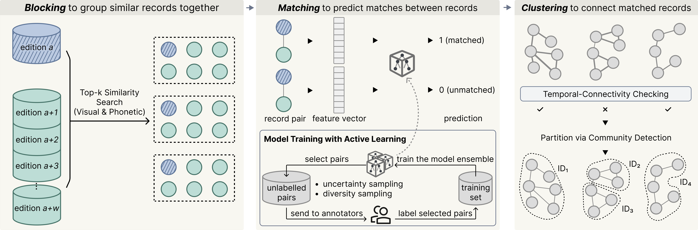

# A Machine Learning Approach for Nominative Record Linkage in Chinese Historical Databases


<a href="https://www.tandfonline.com/doi/full/10.1080/01615440.2026.2641454"></a>
<a href="https://creativecommons.org/licenses/by-sa/4.0/"></a>

This repository contains the code for the paper [A machine learning approach for nominative record linkage in Chinese historical databases](https://www.tandfonline.com/doi/full/10.1080/01615440.2026.2641454) in *Historical Methods*, which implements a comprehensive record linkage pipeline for historical Chinese databases. The methodology is described in detail in our paper and consists of three core stages: **blocking**, **matching**, and **clustering**.

## Overview

This pipeline links records of the same individual across different editions of the Jinshenlu using:
1. **Stroke-based visual similarity embeddings** for efficient blocking
2. **Ensemble machine learning classifiers** trained via active learning
3. **Graph-based clustering** with temporal-connectivity checking to identify unique individuals

**Important Note**: The dataset processed by this code (downloaded from Dataverse) is a **public subset** of the complete CGED-Q JSL dataset used in the paper. Therefore, some parameters (such as `WINDOW_SIZE` during blocking and features for matching) have been adjusted accordingly. The full methodology remains the same, but quantitative results may differ from the paper.

## Table of Contents

- [Installation](#installation)
- [Dataset Information](#dataset-information)
- [Pipeline Overview](#pipeline-overview)
- [Step-by-Step Instructions](#step-by-step-instructions)
  - [Step 0: Download and Convert Dataset](#step-0-download-and-convert-dataset)
  - [Step 1: Preprocess Dataset](#step-1-preprocess-dataset)
  - [Step 2: Blocking](#step-2-blocking)
  - [Step 3: Prepare Training Data (Optional)](#step-3-prepare-training-data-optional)
  - [Step 4: Active Learning (Optional)](#step-4-active-learning-optional)
  - [Step 5: Matching and Clustering](#step-5-matching-and-clustering)
- [Key Parameters](#key-parameters)
- [Output Files](#output-files)
- [Citation](#citation)
- [Acknowledgments](#acknowledgments)

---

## Installation

### Environment Setup

We recommend using conda to manage dependencies. Create and activate the environment:

```bash
# Create conda environment
conda create -n linkage python=3.11

# Activate environment
conda activate linkage

# Install dependencies
pip install -r requirements.txt
```

### Required Files

Ensure these files are present in the `utils/` directory:
- `word2vec_stroke_ngram_3_model_large.bin` - Pre-trained Word2Vec model for stroke embeddings
- `dict_chinese_stroke.txt` - Chinese character to stroke sequence mapping

---

## Dataset Information

The pipeline uses the [**CGED-Q JSL 1850-1864**](https://dataverse.harvard.edu/file.xhtml?fileId=6177054&version=9.0) dataset, which is a public subset of the complete CGED-Q JSL database. This subset contains records of officials from approximately 1850-1864, spanning 27 editions of the Jinshenlu. The pipeline only focuses on officials with surnames, who are mainly Han Chinese civilians.

**Dataset characteristics:**
- **Officials**: Han Chinese civilians (minren 民人)
- **Attributes**: Surname (xing 姓), given name (ming 名), courtesy or style name (zihao 字號), county of origin (rensheng 籍贯縣), province of origin (renxian 籍贯省), qualification for office (chushen 出身), job title (guanzhi 官职), department (jigou 机构), region (diqu 地区)
- **Editions**: Multiple seasonal editions across years
- **Format**: Originally in Stata (.dta) format

---

## Pipeline Overview

The complete pipeline consists of 6 steps:

```
0. Download Dataset from Dataverse & Convert Format
   ↓
1. Preprocess Dataset (add stroke embeddings & pinyin)
   ↓
2. Blocking (identify candidate pairs)
   ↓
3. Prepare Training Data (optional - sample editions for labeling)
   ↓
4. Active Learning (optional - train ensemble classifiers)
   ↓
5. Matching and Clustering (link records into unique IDs)
```




---

## Step-by-Step Instructions

### Step 0: Download and Convert Dataset

#### Step 0.1: Download Dataset

**Script**: [`00_download_dataverse_dataset.py`](./00_download_dataverse_dataset.py)

Downloads the CGED-Q 1850-1864 dataset from Harvard Dataverse.

```bash
python 00_download_dataverse_dataset.py
```

---

#### Step 0.2: Convert Data Format

**Script**: [`01_convert_dataverse_dta_format.py`](./01_convert_dataverse_dta_format.py)

Converts Stata format to CSV and standardizes column names.

```bash
python 01_convert_dataverse_dta_format.py
```

---

### Step 1: Preprocess Dataset

**Script**: [`1_preprocess_dataset.py`](./1_preprocess_dataset.py)

Adds stroke-based embeddings and pinyin representations for text attributes, then splits data by edition.

```bash
python 1_preprocess_dataset.py
```

**Processing details** (from `utils/preprocess.py`):
- Converts traditional/variant characters to standard forms using `char_converter`
- Looks up stroke sequences from `dict_chinese_stroke.txt`
- Generates stroke trigrams (3-grams) for each character
- Extracts tone-less pinyin using `pypinyin`
- Handles missing values (?) and special characters

**Output**:
- `processed_dataset/` directory containing:
  - `df_to_match_edition_{edition_name}.parquet` - One file per edition (~27 files for 1850-1864 subset)
  - `edition_list.csv` - List of all edition identifiers
  - `edition_info.pkl` - Metadata about editions

---

### Step 2: Blocking

**Script**: [`2_blocking.py`](./2_blocking.py)

Identifies candidate record pairs across all editions using hybrid visual-phonetic blocking.

```bash
python 2_blocking.py
```

**Parameters**:
```python
WINDOW_SIZE = 20        # Number of subsequent editions to search. In the paper with the complete dataset, we set it to be 30 (about 7-8 years)
TOP_K = 20              # Candidates per similarity method
NUM_WORKERS = mp.cpu_count() - 2  # Parallel workers
CHUNK_SIZE = 6          # Editions per processing chunk
```

**What it does**:
1. For each edition in the dataset:
   - Loads the edition as "left" data
   - Loads a window of subsequent editions (within WINDOW_SIZE) as "right" data
   - Computes two similarity matrices:
     - **Visual similarity**: Cosine similarity of stroke-based embeddings
     - **Phonetic similarity**: Jaccard similarity of pinyin sets
   - Selects top-k candidates from each method, union gives max 2*k candidates
   - Generates feature vectors for all candidate pairs, which is for the matching classification
   - Identifies "guaranteed matches" (exact match on xing + ming + ren_xian + ren_sheng)
2. Processes editions in chunks with parallel workers
3. Saves results immediately after each chunk (memory efficient)

**Blocking algorithm details** (from [`utils/block_match.py`](./utils/block_match.py)):
- Uses pre-trained Word2Vec model (`word2vec_stroke_ngram_3_model_large.bin`) to convert stroke trigrams to 100-dimensional embeddings
- Character embedding = average of stroke trigram embeddings
- Record embedding = average of character embeddings for xing + ming
- Efficient nearest neighbor search using scikit-learn's `NearestNeighbors`

**Feature extraction** (24 features total):
- **Visual similarity** (10 features): Cosine similarity of stroke embeddings for xing, ming, zihao, diqu, jigou_1, jigou_2, guanzhi_1, ren_xian, ren_sheng, chushen_1
- **Phonetic similarity** (10 features): Jaccard similarity of pinyin for same attributes
- **Name-specific features** (3 features):
  - `ming_cnt_diff`: Difference in number of characters in given names
  - `ming_sim1`: Visual similarity of 1st character in given names
  - `ming_sim2`: Visual similarity of 2nd character in given names
- **Edition context** (1 feature):
  - `same_year`: Binary indicator if records are in same edition
- **Missing values**: Represented as -1
- Note: In our paper we have two more features: the absolute difference between the numeric ranks of the job titles (pinji) and the lower of the two ranks. However, the public dataset does not have this column so these two features are removed. If you want to use this, you need to add the pinji_numeric column to the dataset.

**Output**:
- `processed_data_for_blocking/`:
  - `chunk_*.pkl` - Feature vectors, index pairs, and guaranteed matches

**Note**: This step is the most computationally intensive and may take hours depending on dataset size.

---

### Step 3: Prepare Training Data (Optional)

**Script**: [`3_prepare_training_data.py`](./3_prepare_training_data.py)

**Skip this step if using the 1850-1864 dataset** - we provide annotated training data and trained models in [`active_learning_results/`](./active_learning_results/).

Samples editions to create training data for the matching model.

```bash
python 3_prepare_training_data.py
```

**Parameters**:
```python
TOP_K = 10              # Number of top candidates per similarity method
WINDOW_SIZE = 3         # Number of subsequent editions to search. It is suggested to set it to be small to let the model focus on closely subsequent editions
TRAIN_EDITION_SAMPLE_SIZE = 10  # Number of editions need to be sampled
NUM_WORKERS = mp.cpu_count() - 2  # Parallel processing workers
```

**What it does**:
1. Samples 10 editions evenly distributed across the timeline
2. For each sampled edition:
   - Loads the edition as "left" data
   - Loads a window of subsequent editions within WINDOW_SIZE as "right" data
   - Performs blocking to identify candidate pairs (top-k by visual + phonetic similarity)
   - Computes feature vectors for each candidate pair
3. Parallelizes processing across multiple CPU cores
4. Saves features and original record pairs for manual labeling in Step 4

**Output**:
- `processed_data_for_training/` directory containing:
  - `train.csv` - Feature vectors for all candidate pairs
  - `train_original.json` - Original attribute values for each pair (for manual labeling)

**Note**: This step is also computationally intensive and may take hours depending on data size and CPU cores.

---

### Step 4: Active Learning (Optional)

**Notebook**: [`4_iterative_active_learning.ipynb`](./4_iterative_active_learning.ipynb)

**Skip this step if using the 1850-1864 dataset** - we provide annotated data and trained models in [`active_learning_results/`](./active_learning_results/).

Trains an ensemble of XGBoost classifiers using active learning.

```bash
jupyter notebook 4_iterative_active_learning.ipynb
```

**Workflow**:

1. **Round 0 (Initialization)**:
   - Randomly sample 100 record pairs
   - Export to `active_learning_results/to_label_df0.csv`
   - **Manual**: Annotate pairs in `oracle` column (1=match, 0=non-match)
   - Save as `label_df0.csv`

2. **Rounds 1-N (Iterative training)**:
   - Train ensemble of 25 XGBoost classifiers with bootstrap resampling
   - Compute uncertainty (vote entropy) for unlabeled pairs
   - Select 100 most informative pairs via:
     - Uncertainty sampling: 5,000 most uncertain
     - Diversity sampling: K-means (k=100) + 1 per cluster
   - Export, label manually, add to training set

3. **Final model**:
   - After ~7 rounds (700 labeled pairs total)
   - Train final ensemble with optimized hyperparameters
   - Save to `active_learning_results/ensemble/xgboost_iter7_{0-24}.json`

**Labeling tips**:
- Focus on: name similarity, origin location, career trajectory
- Consider temporal plausibility
- When uncertain, label as non-match (prioritize precision)

**Note**: Adjust `original_feature_list_to_readable_df()` if using different features.

---

### Step 5: Matching and Clustering

**Notebook**: [`5_matching_and_clustering.ipynb`](./5_matching_and_clustering.ipynb)

Applies trained models to all candidate pairs, constructs a graph, and identifies unique individuals via clustering with temporal-connectivity checking.

```bash
jupyter notebook 5_matching_and_clustering.ipynb
```

**Stage 1: Matching**
1. Load all processed editions
2. Load 25 trained XGBoost models
3. Load blocking results from `processed_data_for_blocking/chunk_*.pkl`
4. For each candidate pair:
   - Compute matching probability using ensemble (proportion of positive votes)
   - If probability ≥ `MATCH_THRESHOLD` (0.5), add to edge list with weight = probability
5. Generate "guaranteed match" edges:
   - Records with exact match on `xing` + `ming` + `ren_xian` + `ren_sheng`
   - Within 20 years of each other (`MAX_YEAR_DIFF` is adjustable)
   - Edge weight = 1.0

**Stage 2: Initial Clustering**
1. Construct graph with records as nodes, matches as weighted edges
2. Find connected components
3. Assign preliminary `new_person_id`

**Stage 3: Temporal-Connectivity Checking**
1. For each connected component, calculate **missing edge ratio**:
   ```
   R_missing = N_missing / N_pairs
   ```
   - N_missing = number of missing edges between consecutive editions
   - N_pairs = total pairs of records in consecutive editions
2. If R_missing > 0.3 (threshold), mark as "problematic cluster"
3. Apply **Leiden algorithm** to partition problematic clusters:
   - Performs optimal bisection (split into 2 subclusters)
   - Weight-aware: targets weakest links (low matching probabilities)
   - Recursively partition until R_missing ≤ 0.3 or size < 20 (The thresholds are adjustable)
4. Assign refined `new_person_id_2` based on subcluster memberships

**Implementation details** (from [`utils/postprocess_iterative_partition.py`](./utils/postprocess_iterative_partition.py)):
- Uses `leidenalg` package for community detection
- Converts NetworkX graph to igraph format
- Recursive partitioning with configurable parameters:
  - `MIN_SIZE_FOR_PARTITION=20`: Minimum cluster size to partition
  - `MAX_STRANGE_COUNT=5`: Max missing edges in consecutive editions
  - `MAX_STRANGE_RATIO=0.3`: Max missing edge ratio

**Output**:
- `new_df` DataFrame with:
  - `new_person_id`: Initial cluster ID
  - `sub_comm`: Subcluster ID (if partitioned)
  - `new_person_id_2`: Final unique person ID

**Expected results** (1850-1864 subset):
- ~29,000 unique individuals
- Average career length: ~8.5 editions
- Median career length: 6 editions

---

## Key Parameters

| Parameter | Script | Default | Description |
|-----------|--------|---------|-------------|
| `WINDOW_SIZE` | [3_prepare_training_data.py](./3_prepare_training_data.py) | 3 | Editions to search for training |
| `WINDOW_SIZE` | [2_blocking.py](./2_blocking.py) | 20 | Editions to search for blocking |
| `TOP_K` | [3_prepare_training_data.py](./3_prepare_training_data.py) | 10 | Candidates per method (training) |
| `TOP_K` | [2_blocking.py](./2_blocking.py) | 20 | Candidates per method (blocking) |
| `TRAIN_EDITION_SAMPLE_SIZE` | [3_prepare_training_data.py](./3_prepare_training_data.py) | 10 | Number of editions to sample |
| `INIT_ROUND_NUM` | [4_iterative_active_learning.ipynb](./4_iterative_active_learning.ipynb) | 100 | Initial samples to label |
| Active learning rounds | [4_iterative_active_learning.ipynb](./4_iterative_active_learning.ipynb) | 7 | Iterations |
| Ensemble size | [4_iterative_active_learning.ipynb](./4_iterative_active_learning.ipynb) | 25 | XGBoost classifiers |
| `MATCH_THRESHOLD` | [5_matching_and_clustering.ipynb](./5_matching_and_clustering.ipynb) | 0.5 | Match probability threshold |
| `MAX_YEAR_DIFF` | [5_matching_and_clustering.ipynb](./5_matching_and_clustering.ipynb) | 20 | Max years for guaranteed matches |
| `MAX_STRANGE_RATIO` | [5_matching_and_clustering.ipynb](./5_matching_and_clustering.ipynb) | 0.3 | Temporal-connectivity threshold |
| `MAX_STRANGE_COUNT` | [5_matching_and_clustering.ipynb](./5_matching_and_clustering.ipynb) | 5 | Max missing edges threshold |
| `MIN_SIZE_FOR_PARTITION` | [5_matching_and_clustering.ipynb](./5_matching_and_clustering.ipynb) | 20 | Min cluster size for partition |

---

## Output Files

Complete directory structure after running all steps:

```
linkage code/
├── CGED-Q 1850-1864.dta               # Step 0.1
├── CGED-Q 1850-1864.csv               # Step 0.2
├── processed_dataset/                  # Step 1
│   ├── df_to_match_edition_*.parquet
│   ├── edition_list.csv
│   └── edition_info.pkl
├── processed_data_for_blocking/        # Step 2
│   └── chunk_*.pkl
├── processed_data_for_training/        # Step 3 (optional)
│   ├── train.csv
│   └── train_original.json
├── active_learning_results/            # Step 4 (optional)
│   ├── to_label_df*.csv
│   ├── label_df*.csv
│   └── ensemble/
│       └── xgboost_iter7_*.json
└── [Final results in notebook]         # Step 5
```

---

## Citation

If you use this code or methodology introduced in our paper, please cite:

```bibtex
@article{yu_hou_wu_campbell_2026,
  author = {Yue Yu and Yueran Hou and Yibei Wu and Cameron Campbell},
  title = {A machine learning approach for nominative record linkage in Chinese historical databases},
  journal = {Historical Methods: A Journal of Quantitative and Interdisciplinary History},
  volume = {0},
  number = {0},
  pages = {1--18},
  year = {2026},
  publisher = {Routledge},
  doi = {10.1080/01615440.2026.2641454},
  URL = {https://doi.org/10.1080/01615440.2026.2641454},
  eprint = {https://doi.org/10.1080/01615440.2026.2641454}
}
```

---

## Contact

Please refer to the manuscript for contact details.

---

## Acknowledgments

中国历史官员量化数据库 (CGED) 的录入和数据公开受到香港研究资助局（The Research Grants Council）基金项目的支持 ("Spatial, Temporal, and Social Network Influences on Officials' Careers during the Qing: Creation and Analysis of a National Database from the Jin Shen Lu", HK RGC GRF 16400114, PI: Cameron Campbell)。

This research was supported by HK RGC Areas of Excellence AoE/B-704/22-R (Chen Zhiwu PI).
